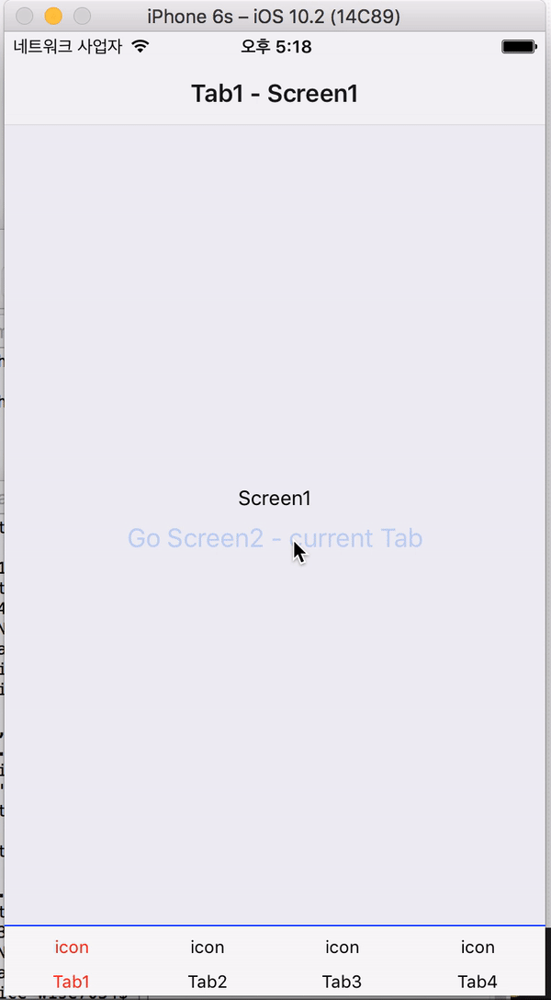
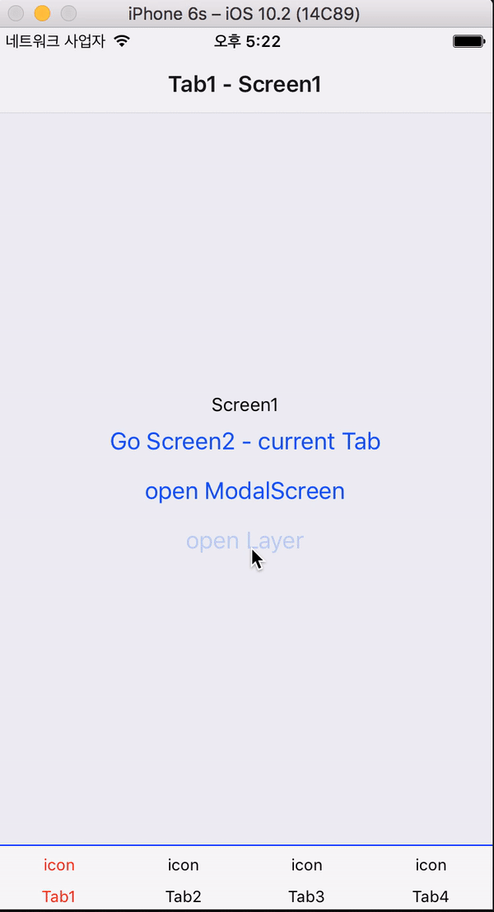

# ReactNative react-navigation Practice

ReactNative에서 네비게이션을 사용할 때 0.43.x까지는 Navigator Component가 있었지만, 0.44 이상에서는 없어졌다.

[Navigation Guide](https://facebook.github.io/react-native/docs/navigation.html)를 보면 다음과 같은 문구가 있다.

React Navigation provides an easy to use navigation solution, with the ability to present common stack navigation and tabbed navigation patterns on both iOS and Android.<br />
(구글번역 : React Navigation은 iOS와 Android 모두에서 일반적인 스택 탐색 및 탭 탐색 패턴을 제공하는 기능과 함께 사용하기 쉬운 탐색 솔루션을 제공합니다.)

그리고 바로 [React Navigation](https://facebook.github.io/react-native/docs/navigation.html#react-navigation)에 대한 설명이 있다.

사내 프로젝트를 하면서 react-navigation을 적용하면서 내가 필요했던 과정을 예제 형태로 정리했다.

react-navigation의 사용법이나 자세한 내용은 [reactnavigation.org](https://reactnavigation.org/)를 참고.

해당 예제를 보고, 더 좋은 방법이나 다른 방법, 코드 등 여러 의견을 환영합니다. :)

## react-navigation 설치
```
npm install react-navigation
```

## Practice 진행 전
index.ios.js, index.android.js를 다음과 같이 원하는 Practice 명을 변경하고 확인.
```
import App from './app/폴더명(Practice명)/index';
```

## Practice1

기본적인 4개의 Tab으로 이뤄진 TabNavigator.

### 구조
- TabNavigator
	- Screen1
	- Screen2
	- Screen3
	- Screen4

### 결과화면


### 코드 설명
```
=== practice1/index.js ===
export default AppNavigator = TabNavigator({
	Screen1: {
		screen: tabScreen1,
		navigationOptions: {
			tabBarLabel: ({ tintColor }) => (
				<View style={styles.tabTextWrap}>
					<Text style={[styles.tabText, { color: tintColor }]}>Tab1</Text>
				</View>
			),
			tabBarIcon: ({ tintColor }) => (
				<Text style={[styles.tabText, { color: tintColor }]}>icon</Text>
			),

		}
	},
	... another Screen
}, {
		initialRouteName: 'Screen1',
		tabBarPosition: 'bottom',
		tabBarOptions: {
			activeTintColor: 'red',
			inactiveTintColor: 'black',
			style: {
				borderTopColor: 'blue',
				borderTopWidth: 1,
			},
			showIcon: true
		},
		lazy: true
	});
```
react-navigation의 TabNavigator(RouteConfigs, TabNavigatorConfig)을 이용했다.

RouteConfigs에는 각 라우터 옵션을 설정했고, TabNavigatorConfig에는 해당 Tab 네비게이션 옵션을 설정했다.<br />
여기서 lazy의 설정에 따라 설정한 라우터 들의 render를 결정한다.(모두 미리 렌더를 하던가, 클릭 시 해당 라우터만 렌더를 한다.)

tabBarPosition은 top, bottom에 따라서 제공하는 tabBarOptions이 다르다. 자세한 내용은 [TabNavigatorConfig](https://reactnavigation.org/docs/navigators/tab#TabNavigatorConfig)를 참고.

android에서는 아이콘이 보이지 않는 경우, tabBarOptions에서 showIcon을 true로 설정하면 된다.

## Practice2
기본적인 4개의 Tab으로 이뤄진 TabNavigator에 각각의 탭에 StackNavigator 작업.

### 구조
- TabNavigator
	- Navigator1
		- Screen1
		- Screen2
	- Navigator2
		- Screen1
		- Screen2
	- Navigator3
		- Screen1
		- Screen2
	- Navigator4
		- Screen1
		- Screen2

### 결과화면


### 코드 설명
```
=== practice2/tabNavigator1.js ===
import { StackNavigator } from 'react-navigation'
export default tabNavigator1 = StackNavigator({
	Screen1: {
		screen: Screen1,
		navigationOptions: {
			title: 'Tab1 - Screen1'
		}
	},
	Screen2: {
		screen: Screen2,
		navigationOptions: {
			title: 'Tab1 - Screen2'
		}
	},
}, {
		initialRouteName: 'Screen1',
		headerMode: 'float'
	});
```

headerMode는 float, screen, none 세가지가 있음. <br /> [StackNavigatorConfig](https://reactnavigation.org/docs/navigators/stack#StackNavigatorConfig)참고

navigationOptions에는 header, gesturesEnabled등 설정 가능. <br /> [Screen Navigation Options](https://reactnavigation.org/docs/navigators/stack#Screen-Navigation-Options)참고

```
=== practice2/Screen1.js ===
const { navigate } = this.props.navigation
...
<Button title="Go Screen2 - current Tab" onPress={() => {
	navigate("Screen2", { id: "Wise" })
}} />
```
navigate를 통해서 push. 이 과정에서 파라미터도 함께 전달.

```
=== practice2/Screen2.js ===
const { goBack, state } = this.props.navigation
...
<Text>ID : {state.params.id}</Text>
<Button title="Go Back" onPress={() => {
	goBack()
}} />
```
state를 통해서 받은 파마리터 사용.<br />
goBack를 통해서 back

## Practice3
작업을 진행하면서 TabNavigator 위의 Global Modal이 필요하여 작업함.<br />
(Login, 링크 클릭시 앱안에서의 Custom 웹뷰 등등 다양한 용도로 사용)

### 구조
- TabNavigator
	- Navigator1
		- Screen1
		- Screen2
	- Navigator2
		- Screen1
		- Screen2
	- Navigator3
		- Screen1
		- Screen2
	- Navigator4
		- Screen1
		- Screen2
- ModalScreen

### 결과화면


### 코드 설명
```
export default AppNavigator = StackNavigator({
	TabBarNavigator: {
		screen: TabBarNavigator,
	},
	ModalScreen: {
		screen: ModalScreen,
	},
},
	{
		initialRouteName: 'TabBarNavigator',
		headerMode: 'none',
		mode: 'modal',
	})
```
StackNavigator에서 StackNavigatorConfig의 mode를 'modal'로 추가하여 사용.

## Practice4

작업을 진행하면서 TabNavigator를 덮는 레이어가 필요하여 진행.

**처음에는 페이지 내에서 Modal Component를 사용하려 했으나, Modal Component에서 Practice3에서 만들었던 ModalScreen을 띄울 수 없는 문제가 발생하여 다음과 같이 레이어 형태로 작업하게 됨. (혹시 다른 방법이나 더 나은 방법이 있으면 피드백 부탁드립니다.)**

### 구조
- TabNavigator
	- Navigator1
		- Screen1
		- Screen2
	- Navigator2
		- Screen1
		- Screen2
	- Navigator3
		- Screen1
		- Screen2
	- Navigator4
		- Screen1
		- Screen2
- Layer
- ModalScreen

### 결과화면


### 코드 설명
```
import Layer from './Layer'
...
function CustomTabNavigator(routes, options) {
	const TabNav = TabNavigator(routes, options);
	return class CustomTabNav extends Component {
		static router = TabNav.router
		render() {
			const { state } = this.props.navigation;
			const nav = {
				...this.props.navigation,
				currentTab: state.index,
				toggleLayer: () => { this.refs._Layer.toggleLayer() },
			}
			return (
				<View style={{ flex: 1 }}>
					<TabNav
						navigation={nav}
					/>
					<Layer ref="_Layer" {...this.props} navigation={nav} />
				</View>
			);
		}
	}
}

const TabBarNavigator = CustomTabNavigator({
```
기본적으로 제공하는 TabNavigator을 감싸는 CustomTabNavigator를 만들어서 사용했다.

추후 현재 탭 index가 필요할 것 같아서 currentTab을 만들었다.

Layer는 <Animated.View>를 이용하여 toggle시 show, hide를 적용해서 사용했다.